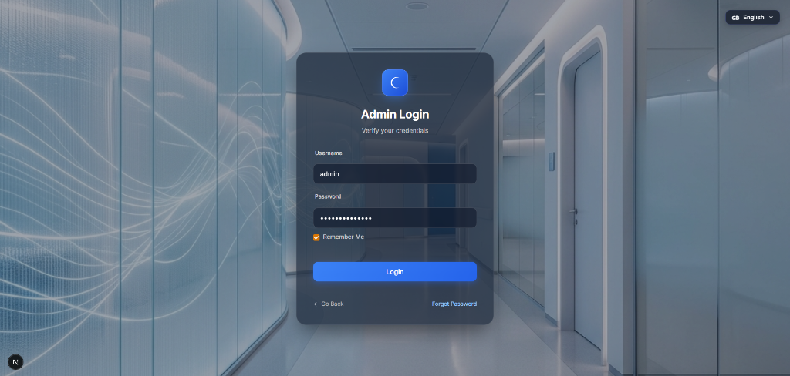
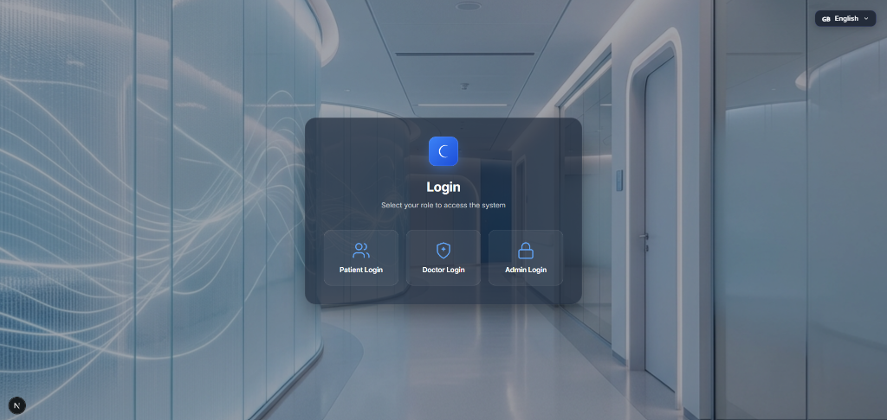
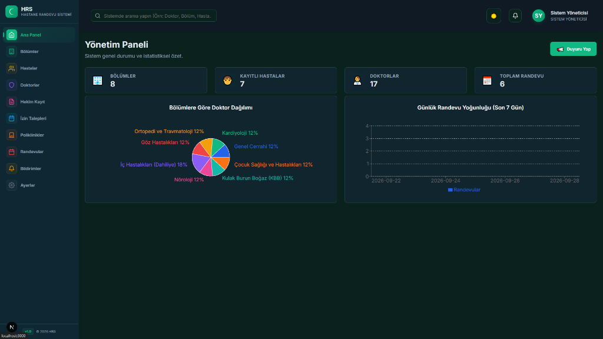
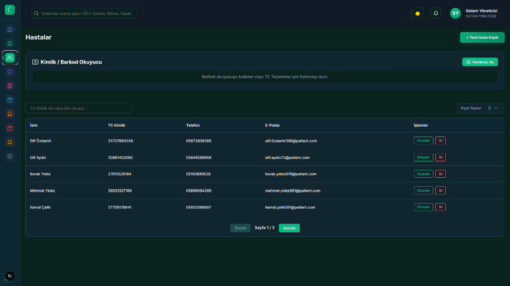
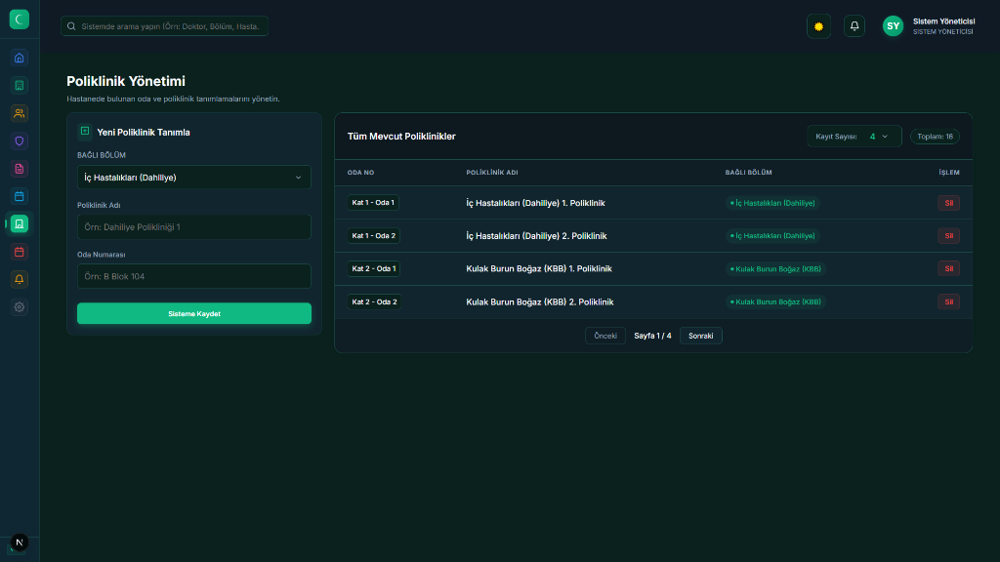
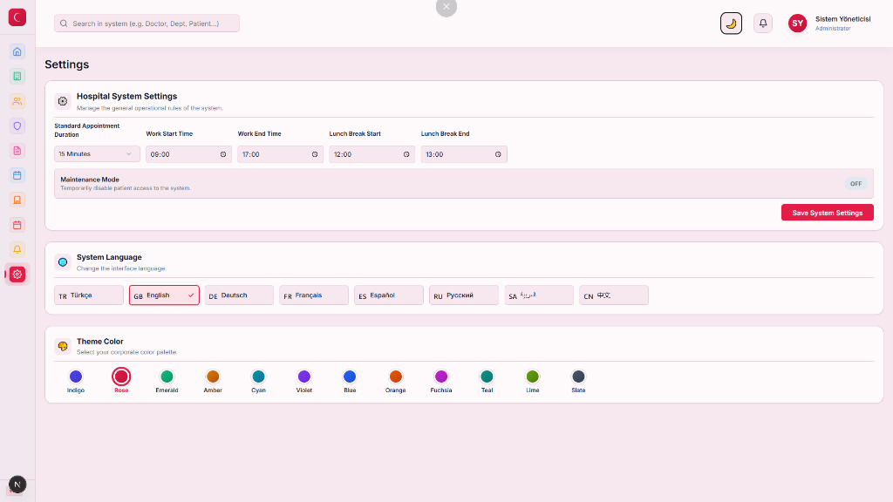
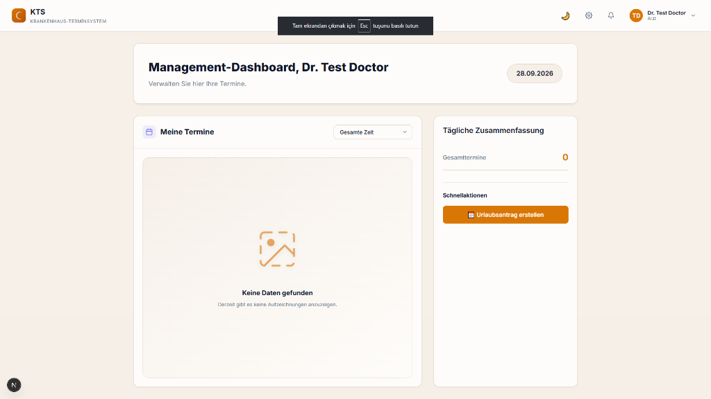
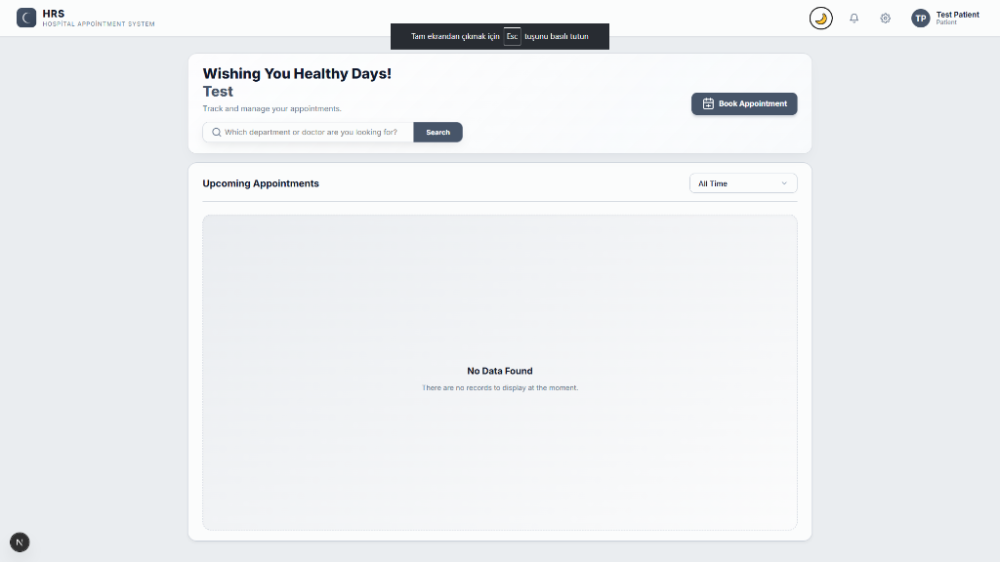

<div align="center">

# 🏥 Hospital Management System

### Full-Stack Hospital Management Platform

A full-stack hospital management application for managing users, doctors, patients, appointments, examinations, departments, notifications, and doctor schedules.

Built with **Spring Boot**, **Next.js**, **React**, and relational database technologies, with a focus on clean backend architecture, authentication, authorization, database migrations, testing, and production-oriented engineering practices.

<br/>

[](https://github.com/akifkeklik/hospital-management-system/actions/workflows/build.yml)
[](https://openjdk.org/)
[](https://spring.io/projects/spring-boot)
[](https://nextjs.org/)
[](https://react.dev/)
[](https://www.mysql.com/)
[](https://www.docker.com/)
[](LICENSE)

<br/>

**Current Status: Production Deployment & Hardening**

</div>

---

## 📑 Contents

* [Overview](#-overview)
* [Screenshots](#-screenshots)
* [Features](#-features)
* [Architecture](#-architecture)
* [Backend Architecture](#-backend-architecture)
* [Technology Stack](#-technology-stack)
* [Project Structure](#-project-structure)
* [Getting Started](#-getting-started)
* [Configuration](#-configuration)
* [API](#-api)
* [Authentication & Security](#-authentication--security)
* [Database](#-database)
* [Caching](#-caching)
* [Observability](#-observability)
* [Testing](#-testing)
* [Docker](#-docker)
* [CI/CD](#-cicd)
* [Deployment](#-deployment)
* [Password Reset](#-password-reset)
* [Development Notes](#-development-notes)
* [Contributing](#-contributing)
* [License](#-license)

---

# 🌟 Overview

**Hospital Management System** is a full-stack web application designed to manage common hospital workflows through a centralized platform.

The application provides different capabilities depending on the user's role, including:

* User authentication
* Patient management
* Doctor management
* Appointment scheduling
* Examination records
* Departments and polyclinics
* Doctor leave management
* Patient notifications
* Administrative management
* Dashboard and reporting interfaces

The backend is implemented with **Spring Boot** and follows a modular layered architecture. The frontend is implemented with **Next.js and React**.

The project also includes database migrations, automated tests, security controls, application metrics, request tracing, caching, Docker support, and GitHub Actions CI.

---

# 📸 Screenshots

A visual overview of the main application interfaces across all user roles.

### Authentication

<p align="center">
  
  
</p>

### Admin Panel

<p align="center">
  
</p>

<p align="center">
  
  
</p>

<p align="center">
  
</p>

### Doctor & Patient Dashboards

<p align="center">
  
  
</p>

---

# ✨ Features

## 👤 User Management

* User registration
* User authentication
* Role-based access
* User information management
* Password recovery flow

Supported application roles include:

```text
ADMIN
DOCTOR
PATIENT
```

---

## 📅 Appointment Management

* Appointment creation
* Appointment listing
* Appointment updates
* Appointment cancellation
* Doctor appointment views
* Patient appointment history
* Doctor availability
* Time-slot management
* Appointment conflict prevention

---

## 👨‍⚕️ Doctor Management

* Doctor profiles
* Department association
* Polyclinic association
* Doctor schedules
* Doctor leave management
* Appointment management

---

## 🧑‍🦽 Patient Management

* Patient profiles
* Patient information management
* Appointment history
* Examination history
* Medical record access according to authorization rules

---

## 🩺 Examination Management

* Examination records
* Patient examination history
* Diagnosis information
* Prescription information
* Doctor-controlled examination workflows

---

## 🏥 Hospital Organization

* Department management
* Polyclinic management
* Doctor-to-department relationships
* Doctor-to-polyclinic relationships

---

## 🤖 AI Symptom Analyzer (Gemini Integration)

* AI-driven patient symptom analysis
* Department routing recommendations
* Frontend integration for patients
* **Note:** Gemini integration is optional. Without `GEMINI_API_KEY`, the application uses the built-in demo fallback. A real Gemini API key can be supplied through environment configuration.

---

## 🔔 Notifications

The system contains notification functionality for application-level patient and system notifications.

---

## 🌍 Frontend

The frontend provides role-oriented interfaces for:

* Administration
* Doctors
* Patients
* Appointments
* Patient records
* Departments
* Settings
* Notifications
* Authentication

Additional frontend capabilities include:

* Responsive UI
* Turkish / English localization
* Interactive charts
* Hospital map interface
* OCR functionality through Tesseract.js

---

# 🏗 Architecture

The project currently follows a **modular monolithic architecture**.

The backend is deployed as a single Spring Boot application while its business functionality is separated into domain modules.

```text
┌─────────────────────────────────────────────────────────────────────┐
│                         CLIENT (Browser)                             │
│                    Next.js 16 + React 19 SPA                       │
│                                                                     │
│        ┌──────────┬──────────────┬─────────────────────┐            │
│        │  Admin   │    Doctor    │       Patient       │            │
│        │  Panel   │   Dashboard  │       Portal        │            │
│        └────┬─────┴──────┬───────┴──────────┬──────────┘            │
└─────────────┼────────────┼──────────────────┼──────────────────────┘
              │            │                  │
              └────────────┼──────────────────┘
                           │ REST API (JSON)
                           ▼
┌─────────────────────────────────────────────────────────────────────┐
│                    SPRING BOOT 3.3.5 BACKEND                        │
│                                                                     │
│  ┌─────────────┐  ┌──────────────┐  ┌────────────────────┐         │
│  │  Security   │  │  Web Layer   │  │    AI Service      │         │
│  │             │  │              │  │                    │         │
│  │  JWT Auth   │  │  Controllers │  │  Gemini API Client │         │
│  │  RBAC       │  │  DTOs        │  │  Symptom Analyzer  │         │
│  │  Rate Limit │  │  Validation  │  │  Dept. Router      │         │
│  └──────┬──────┘  └──────┬───────┘  └─────────┬──────────┘         │
│         │                 │                    │                    │
│         └─────────────────┼────────────────────┘                    │
│                           ▼                                         │
│  ┌───────────────────────────────────────────────────────────────┐  │
│  │                    Service Layer                              │  │
│  │                                                               │  │
│  │ Appointment · Doctor · Patient · Examination                  │  │
│  │ Department · Polyclinic · Notification · DoctorLeave          │  │
│  └───────────────────────────┬───────────────────────────────────┘  │
│                              │                                      │
│  ┌───────────────────────────▼───────────────────────────────────┐  │
│  │             Data Access Layer (Spring Data JPA)              │  │
│  │             Flyway Migrations · Hibernate ORM                 │  │
│  └───────────────────────────┬───────────────────────────────────┘  │
└──────────────────────────────┼──────────────────────────────────────┘
                               │
                    ┌──────────▼──────────┐
                    │       MySQL 8       │
                    │  Database Backend   │
                    └─────────────────────┘
```

---

# 🧩 Backend Architecture

Backend domains are separated into modules.

```text
src/main/java/com/hospital/appointmentsystem/

├── appointment/
├── doctor/
├── patient/
├── examination/
├── department/
├── polyclinic/
├── notification/
├── doctorleave/
├── user/
├── setting/
├── security/
├── config/
└── exception/
```

Most domain modules follow a structure similar to:

```text
module/

├── api/
├── impl/
└── web/
```

Where applicable:

* `api/` contains DTOs and contracts
* `impl/` contains domain implementation and persistence logic
* `web/` contains REST controllers

This structure keeps controllers, business logic, and persistence concerns separated.

---

# 🛠 Technology Stack

## Backend

| Technology           | Version | Purpose                          |
| -------------------- | ------: | -------------------------------- |
| Java                 |      17 | Backend language                 |
| Spring Boot          |   3.3.5 | Application framework            |
| Spring Security      |     6.x | Security and authorization       |
| Spring Data JPA      |     3.x | Data access                      |
| Hibernate            |     6.x | ORM                              |
| Flyway               |    10.x | Database migrations              |
| JJWT                 |  0.11.5 | JWT handling                     |
| Bucket4J             |  8.10.1 | Rate limiting                    |
| Micrometer           |       — | Application metrics              |
| Spring Boot Actuator |       — | Health and operational endpoints |
| Maven                |    3.9+ | Build and dependency management  |

## Frontend

| Technology   | Version | Purpose            |
| ------------ | ------: | ------------------ |
| Next.js      |      16 | Frontend framework |
| React        |      19 | UI library         |
| Recharts     |     3.9 | Charts             |
| Tesseract.js |     7.0 | OCR                |
| CSS Modules  |       — | Component styling  |

## Infrastructure

| Technology     | Purpose                      |
| -------------- | ---------------------------- |
| Docker         | Containerization             |
| GitHub Actions | Continuous integration       |
| MySQL 8        | Primary database             |
| Aiven          | Cloud-managed MySQL database |
| Render         | Backend hosting              |
| Vercel         | Frontend hosting             |

---

# 📁 Project Structure

```text
hospital-management-system/

│
├── .github/
│   └── workflows/
│       └── build.yml
│
├── docs/
│   ├── PROJECT_MASTER_PLAN.md
│   ├── FRONTEND-UX-MAP.md
│   └── DATABASE-MIGRATION-*.md
│
├── frontend/
│   └── src/
│       ├── app/
│       │   ├── admin/
│       │   ├── doctor/
│       │   ├── appointments/
│       │   ├── book-appointment/
│       │   ├── departments/
│       │   ├── patients/
│       │   ├── patient-records/
│       │   ├── patient-notifications/
│       │   ├── settings/
│       │   ├── login/
│       │   ├── register/
│       │   └── forgot-password/
│       │
│       ├── components/
│       ├── context/
│       ├── hooks/
│       ├── services/
│       ├── locales/
│       └── utils/
│
├── src/
│   ├── main/
│   │   ├── java/
│   │   │   └── com/hospital/appointmentsystem/
│   │   │       ├── appointment/
│   │   │       ├── doctor/
│   │   │       ├── patient/
│   │   │       ├── examination/
│   │   │       ├── department/
│   │   │       ├── polyclinic/
│   │   │       ├── notification/
│   │   │       ├── doctorleave/
│   │   │       ├── user/
│   │   │       ├── setting/
│   │   │       ├── security/
│   │   │       ├── config/
│   │   │       └── exception/
│   │   │
│   │   └── resources/
│   │       ├── application.properties
│   │       └── db/
│   │           └── migration/
│   │               └── mysql/
│   │
│   └── test/
│
├── Dockerfile
├── pom.xml
└── README.md
```

---

# 🚀 Getting Started

## 🔑 Credentials (Development Only)

> [!WARNING]
> The application does **not** have a hardcoded default admin password. You **must** provide an `ADMIN_PASSWORD` environment variable to start the application.

If the application is started in a non-production profile such as `dev`, it can provision test users for local development.

| Role             | Username (TC) | Password                                       |
| ---------------- | ------------- | ---------------------------------------------- |
| **Admin**        | `admin`       | *Set by `ADMIN_PASSWORD` environment variable* |
| **Test Doctor**  | `88888888888` | `local_test_secret_2026`                       |
| **Test Patient** | `99999999999` | `local_test_secret_2026`                       |

The test-user password can be configured through the `TEST_USER_PASSWORD` environment variable.

---

## Prerequisites

Install the following:

* Java 17+
* Maven 3.9+
* Node.js
* npm
* MySQL 8
* Git

### Infrastructure

| Technology         | Purpose                          |
| ------------------ | -------------------------------- |
| **Docker**         | Multi-stage containerized builds |
| **GitHub Actions** | CI/CD pipeline                   |
| **MySQL 8**        | Primary database                 |
| **Aiven**          | Cloud-managed MySQL database     |

---

## 1. Clone

```bash
git clone https://github.com/akifkeklik/hospital-management-system.git
cd hospital-management-system
```

---

## 2. Configure Environment Variables

Set the required environment variables in your shell or use the `.env` file for Docker Compose. You can refer to the existing `.env.example` file in the project root as a starting point.

Example configuration for local development:

```bash
export ADMIN_PASSWORD="your-local-admin-password"
export JWT_SECRET="your-local-jwt-secret"
export GEMINI_API_KEY="your-gemini-api-key"
# other configs like mail/password reset...
```

Do **not** commit real secrets to Git.

---

## 3. Run Backend & Database

You can run the backend and database either natively or using Docker Compose.

### Option A: Native Development

**1. Create a Local Database:**

```sql
CREATE DATABASE hospitaldb;
```
Make sure the MySQL server is running on `localhost:3306`.

**2. Start the Backend:**

```bash
mvn clean compile
mvn spring-boot:run
```
The backend runs on `http://localhost:8080`.

### Option B: Docker Compose

The project includes a `docker-compose.yml` for running the backend and MySQL together in isolated containers.

**Local Development Architecture (Docker Compose):**
```text
Developer Browser
       │
       ├──> Next.js Frontend (Native) :3000
       │
       ├──> Spring Boot Backend (Docker) :8080
       │
       └──> MySQL (Docker)
              ├── Internal Docker Port: 3306
              └── Mapped Host Port: 3307
```

* **Backend**: Spring Boot container on port `8080`. Healthcheck: `/actuator/health`
* **Database**: MySQL 8 container with named volume `mysql_data`.
* **Networking**: The backend container connects to the MySQL container over the Docker network using `jdbc:mysql://mysql:3306/hospitaldb`.
* **Host Port Mapping**: To avoid conflicts with local MySQL installations (`localhost:3306`), the Docker MySQL is exposed to the host machine on `localhost:3307` (`3307:3306`). Flyway migrations run automatically on backend startup.

**Start the containers:**
```bash
docker compose up -d --build
```

**Check status:**
```bash
docker compose ps
```

**View logs:**
```bash
docker compose logs backend --tail=100
docker compose logs mysql --tail=100
```

**Stop the containers:**
```bash
docker compose down
```

> [!WARNING]
> Running `docker compose down -v` will delete the `mysql_data` volume and all local database data within Docker.

---

## 4. Start the Frontend

The frontend is developed natively using Node.js and is **not** included in the Docker Compose setup (in production, it is deployed to Vercel).

```bash
cd frontend
npm install
npm run dev
```

*(On PowerShell you may need to use `npm.cmd run dev`)*

The frontend runs on:

```text
http://localhost:3000
```

---

## 6. Security on First Run

When running the application for the first time, it expects the `ADMIN_PASSWORD` environment variable.

* **Admin User:** Created automatically using the supplied `ADMIN_PASSWORD`.
* **Test Doctor:** `88888888888`
* **Test Patient:** `99999999999`

Test users are provisioned only when the appropriate development/test profile is active.

---

# ⚙️ Configuration

The application is configured primarily through environment variables.

| Variable                   | Required | Description                                       |
| -------------------------- | -------- | ------------------------------------------------- |
| `ADMIN_PASSWORD`           | Yes      | Password used when provisioning the default admin |
| `JWT_SECRET`               | Yes      | Secret used to sign JWT tokens                    |
| `DB_URL`                   | No       | JDBC database connection                          |
| `DB_DRIVER`                | No       | JDBC driver                                       |
| `DB_USERNAME`              | No       | Database username                                 |
| `DB_PASSWORD`              | No       | Database password                                 |
| `DDL_AUTO`                 | No       | Hibernate schema strategy                         |
| `SHOW_SQL`                 | No       | Enable SQL logging                                |
| `CORS_ALLOWED_ORIGINS`     | No       | Allowed frontend origins                          |
| `RATE_LIMIT_AUTH_CAPACITY` | No       | Authentication rate-limit capacity                |
| `RATE_LIMIT_AUTH_MINUTES`  | No       | Authentication rate-limit window                  |
| `TEST_USER_PASSWORD`       | No       | Password for local development test users         |
| `GEMINI_API_KEY`           | No       | Google Gemini API authentication (Empty = demo)   |
| `GEMINI_API_URL`           | No       | Gemini HTTP endpoint                              |

Defaults may differ between local and production environments.

Production credentials should always be supplied through the deployment platform's secret/environment configuration.

---

# 📡 API

The backend exposes REST endpoints under `/api`.

## Authentication

| Method | Endpoint                          | Description                |
| ------ | --------------------------------- | -------------------------- |
| POST   | `/api/auth/register`              | Register patient           |
| POST   | `/api/auth/doctor-register`       | Register doctor            |
| POST   | `/api/auth/login`                 | Authenticate user          |
| POST   | `/api/auth/logout`                | Clear auth cookie          |
| POST   | `/api/auth/forgot-password`       | Initiate password recovery |
| POST   | `/api/auth/reset-password`        | Complete password recovery |
| POST   | `/api/auth/force-change-password` | Required password change   |
| GET    | `/api/auth/me`                    | Current authenticated user |

## Appointments

| Method | Endpoint                         | Description          |
| ------ | -------------------------------- | -------------------- |
| GET    | `/api/appointments`              | List appointments    |
| POST   | `/api/appointments`              | Create appointment   |
| PUT    | `/api/appointments/{id}`         | Update appointment   |
| DELETE | `/api/appointments/{id}`         | Cancel appointment   |
| GET    | `/api/appointments/doctor/{id}`  | Doctor appointments  |
| GET    | `/api/appointments/patient/{id}` | Patient appointments |

## Doctors

| Method | Endpoint                            | Description          |
| ------ | ----------------------------------- | -------------------- |
| GET    | `/api/doctors`                      | List doctors         |
| GET    | `/api/doctors/{id}`                 | Doctor details       |
| GET    | `/api/doctors/{id}/available-slots` | Available time slots |

## Patients

| Method | Endpoint             | Description     |
| ------ | -------------------- | --------------- |
| GET    | `/api/patients`      | List patients   |
| GET    | `/api/patients/{id}` | Patient details |
| PUT    | `/api/patients/{id}` | Update patient  |

## Examinations

| Method | Endpoint                         | Description                 |
| ------ | -------------------------------- | --------------------------- |
| GET    | `/api/examinations`              | List examinations           |
| POST   | `/api/examinations`              | Create examination          |
| GET    | `/api/examinations/patient/{id}` | Patient examination history |

## Departments & Polyclinics

| Method | Endpoint           | Description      |
| ------ | ------------------ | ---------------- |
| GET    | `/api/departments` | List departments |
| GET    | `/api/polyclinics` | List polyclinics |

## System

| Method | Endpoint               | Description         |
| ------ | ---------------------- | ------------------- |
| GET    | `/actuator/health`     | Application health  |
| GET    | `/actuator/prometheus` | Application metrics |

> The exact authorization requirements of individual endpoints are enforced by the backend security configuration.

## 📖 Swagger / OpenAPI Documentation

The backend provides interactive API documentation using **Springdoc OpenAPI**.

* **Swagger UI:** [http://localhost:8080/swagger-ui/index.html](http://localhost:8080/swagger-ui/index.html)
* **OpenAPI JSON:** [http://localhost:8080/v3/api-docs](http://localhost:8080/v3/api-docs)

You can use the Swagger UI to explore and test the available REST endpoints. **JWT Bearer authentication** is supported directly in the Swagger UI. To test secured endpoints, first authenticate via `/api/auth/login`, copy the JWT token, and click the "Authorize" button in Swagger UI to provide your token.

The API currently exposes all endpoints documented above.

---

# 🔐 Authentication & Security

Security is implemented with Spring Security and JWT-based authentication.

## Authentication Flow

```text
Client
  │
  │ POST /api/auth/login
  ▼
Authentication Controller
  │
  ├── Validate request
  ├── Find user
  ├── Verify BCrypt password
  └── Generate JWT
  │
  ▼
Client receives JWT
  │
  │ Authorization: Bearer <token>
  ▼
JWT Authentication Filter
  │
  ├── Validate token
  ├── Extract user identity
  └── Establish SecurityContext
  │
  ▼
Authorization
  │
  ├── Role checks
  └── Endpoint permissions
  │
  ▼
Controller → Service → Repository
```

## Security Controls

### JWT Authentication

The backend uses stateless JWT authentication.

### Role-Based Authorization

The main application roles are:

```text
ADMIN
DOCTOR
PATIENT
```

### Password Security

Passwords are stored using **BCrypt hashing** rather than plaintext storage.

### Rate Limiting

Authentication endpoints are protected by Bucket4J-based rate limiting to reduce brute-force attempts.

### CORS

Cross-origin requests are controlled through backend CORS configuration.

### Request Validation

Incoming request data is validated before entering the business layer.

### Request Tracing

Requests receive trace identifiers through the request logging infrastructure, making application logs easier to correlate.

---

# 🗄 Database

The application uses relational database persistence through:

* Spring Data JPA
* Hibernate
* Flyway

## Database Support

The system uses **MySQL 8** as its primary database.

| Environment       | Database | Driver                     |
| ----------------- | -------- | -------------------------- |
| Local Development | MySQL 8  | `com.mysql.cj.jdbc.Driver` |
| Cloud (Aiven)     | MySQL 8  | `com.mysql.cj.jdbc.Driver` |

### Schema Migration

Database versioning is managed by **Flyway** with vendor-specific migration scripts:

```text
src/main/resources/db/migration/

└── mysql/
    └── V1__init_schema.sql
```

Flyway automatically applies the migration scripts on application startup.

## Main Domain Relationships

```text
User
├── Doctor
│   ├── Department
│   ├── Polyclinic
│   ├── Appointments
│   └── Doctor Leave
│
└── Patient
    ├── Appointments
    ├── Examinations
    └── Notifications
```

---

# ⚡ Caching

The backend includes Spring Cache support for selected read-heavy operations.

The current approach uses application-level caching without requiring an external cache service.

This keeps the deployment architecture relatively simple while providing a path for future optimization.

An external cache such as Redis can be considered later if actual production workload requires it.

---

# 📊 Observability

The backend includes basic application observability through Spring Boot Actuator and Micrometer.

## Health Check

```text
GET /actuator/health
```

## Prometheus Metrics

```text
GET /actuator/prometheus
```

## Request Logging

Requests are logged with correlation information using MDC-based trace IDs.

This makes it easier to follow a request across:

```text
HTTP Request
      ↓
Controller
      ↓
Service
      ↓
Repository
      ↓
Database
```

---

# 🧪 Testing

The project contains tests covering multiple areas of the application.

| Test Area                   | Technology            |
| --------------------------- | --------------------- |
| Unit testing                | JUnit 5               |
| Mocking                     | Mockito               |
| Spring integration testing  | Spring Boot Test      |
| Security testing            | Spring Security Test  |
| Test database               | H2                    |
| Database performance checks | Custom test utilities |

**Current Snapshot:** The repository contains **209 tests** validating various application components.

All tests are designed to run in isolation using an in-memory **H2 database** and **mocked external services** (such as the Gemini AI client). This ensures that executing tests (locally or in CI) does not require any external connections (e.g., MySQL, Render, Aiven, or Google Gemini).

## Run All Tests

```bash
mvn test
```

Test reports are generated in `target/surefire-reports` after execution.

## JaCoCo Code Coverage

The project is actively configured with the JaCoCo Maven plugin (`org.jacoco:jacoco-maven-plugin:0.8.12`) for test coverage analysis.

Code coverage is generated automatically during the Maven test lifecycle. Once tests finish executing, you can view the detailed coverage report by opening the following HTML file in your browser:

```text
target/site/jacoco/index.html
```

## Run a Specific Test

```bash
mvn test -Dtest=AppointmentServiceTest
```

## SQL Debugging

```bash
mvn test -Dspring.jpa.show-sql=true
```

### Performance Testing

The project includes custom database performance analyzers:

* **`NPlusOneBaselineTest`** — Detects N+1 query problems
* **`DatabaseIndexAnalyzer`** — Analyzes index usage efficiency
* **`DatabaseIndexVerifier`** — Verifies required indexes exist

These are used to identify inefficient query patterns and verify expected database indexes.

---

# 🐳 Docker

The project includes a `Dockerfile` for containerized backend deployment. It uses a multi-stage build process to provide a lightweight production image.

### Build

```bash
docker build -t hospital-management-system .
```

### Run

```bash
docker run -p 8080:8080 \
  -e ADMIN_PASSWORD="your-admin-password" \
  -e JWT_SECRET="your-secret" \
  -e DB_URL="jdbc:mysql://host:3306/hospitaldb" \
  -e DB_DRIVER="com.mysql.cj.jdbc.Driver" \
  -e DB_USERNAME="your-user" \
  -e DB_PASSWORD="your-password" \
  hospital-management-system
```

> For production, secrets should be provided securely through the deployment environment, such as Render Environment Variables, rather than hardcoded.

---

# 🔄 CI/CD

**GitHub Actions** is used for continuous integration, validating both backend and frontend environments automatically on pushes and pull requests.

```text
Git Push / Pull Request
          │
          ▼
    GitHub Actions
          │
     ┌────┴─────┐
     ▼          ▼
  Backend    Frontend
     │          │
     ▼          ▼
  Maven        npm
  Build       Build
(& Tests)
     │          │
     └────┬─────┘
          ▼
       CI Result
```

Workflow configuration is located at:

```text
.github/workflows/build.yml
```

> **Note:** GitHub Actions validates the application by running all **209 backend tests** via `mvn clean package` (using Java 17). The frontend is built using Node 20 (`npm run build`). Upon success, Surefire test reports and JaCoCo coverage reports are uploaded as artifacts (retained for 7 days).
>
> **Production Safety:** The CI pipeline is strictly for build/test/quality validation. It does **not** perform production deployments and contains **no hardcoded production secrets**.

---

# ☁️ Deployment

The application uses a production-oriented architecture that separates the frontend, backend, and database layers.

## Production Architecture

```text
┌───────────────────────────────┐
│           Frontend            │
│        Next.js (Vercel)       │
└───────────────┬───────────────┘
                │ HTTPS (REST API)
                ▼
┌───────────────────────────────┐
│            Backend            │
│      Spring Boot (Render)     │
└───────────────┬───────────────┘
                │ TCP (JDBC/SSL)
                ▼
┌───────────────────────────────┐
│           Database            │
│       MySQL 8.4 (Aiven)       │
└───────────────────────────────┘
```

## 1. Database Deployment (Aiven)

* The application uses **Aiven MySQL** for the production database.
* Database schemas and initial data are automatically managed and migrated by **Flyway** on application startup.

## 2. Backend Deployment (Render)

* The Spring Boot backend is deployed as a Web Service on **Render**.
* Environment variables such as `ADMIN_PASSWORD`, `JWT_SECRET`, `DB_URL`, `DB_USERNAME`, `DB_PASSWORD`, and `CORS_ALLOWED_ORIGINS` must be configured in the Render Dashboard.
* Application health can be monitored through Spring Boot Actuator endpoints.

## 3. Frontend Deployment (Vercel)

* The Next.js frontend is deployed on **Vercel**.
* ⚠️ **Important:** The `Root Directory` must be set to `frontend` in the Vercel Project Settings under `Settings → General → Root Directory`.
* The `NEXT_PUBLIC_API_URL` environment variable must point to the live Render backend URL.

---

# 🔐 Password Reset

The application implements a token-based password reset mechanism using **Resend** as the email provider.

## Architecture

* **Token Generation:** Securely generated 32-byte tokens using `SecureRandom`.
* **Storage:** Only the SHA-256 hash of the token is stored in the database to reduce token exposure risk.
* **Expiration:** Tokens expire after 30 minutes by default.
* **Single-Use:** Tokens are invalidated after a successful reset.
* **Security:**

  * Prevents user enumeration on the `/forgot-password` endpoint.
  * Implements rate limiting.
  * Enforces strong password policies with BCrypt hashing.

## Production Configuration (Resend Integration)

To enable email delivery in production, configure the following environment variables:

| Environment Variable                      | Description                           | Example Value                             |
| ----------------------------------------- | ------------------------------------- | ----------------------------------------- |
| `RESEND_API_KEY`                          | Resend API key                        | `re_123456789`                            |
| `PASSWORD_RESET_EMAIL_FROM`               | Sender address from a verified domain | `no-reply@yourdomain.com`                 |
| `PASSWORD_RESET_EMAIL_ENABLED`            | Feature toggle for email delivery     | `true`                                    |
| `PASSWORD_RESET_TOKEN_EXPIRATION_MINUTES` | Token validity duration               | `30`                                      |
| `FRONTEND_BASE_URL`                       | Frontend URL used for reset links     | `https://your-frontend-domain.vercel.app` |

### Important Setup Steps for Resend

1. Add and verify your sending domain in the Resend Dashboard.
2. Add the required DNS records provided by Resend.
3. Ensure the sender address matches the verified domain.
4. For testing without a verified domain, Resend may restrict delivery to the email address associated with the account depending on the account configuration.

---

# 🧭 Development Notes

This project is intentionally being developed incrementally.

Current engineering priorities include:

* Production database configuration
* Production deployment
* End-to-end environment verification
* Observability verification
* Security validation
* Application reliability
* Deployment reproducibility

The project favors **simple and maintainable architecture** over unnecessary infrastructure complexity.

For example, external infrastructure such as Redis or a message broker should only be introduced when there is a demonstrated requirement for it.

---

# 🤝 Contributing

Contributions are welcome.

## Development Workflow

Create a feature branch:

```bash
git checkout -b feature/my-feature
```

Make your changes and run the test suite:

```bash
mvn test
```

Commit using Conventional Commits:

```bash
git commit -m "feat: add appointment validation"
```

Push:

```bash
git push origin feature/my-feature
```

Then open a Pull Request.

## Commit Convention

| Prefix      | Meaning          |
| ----------- | ---------------- |
| `feat:`     | New feature      |
| `fix:`      | Bug fix          |
| `refactor:` | Code refactoring |
| `test:`     | Tests            |
| `docs:`     | Documentation    |
| `chore:`    | Maintenance      |

---

# 📄 License

This project is licensed under the **MIT License**.

See [LICENSE](LICENSE) for details.

---

<div align="center">

### Built with ❤️ by [Akif Keklik](https://github.com/akifkeklik)

<br/>

[](https://github.com/akifkeklik)

</div>
